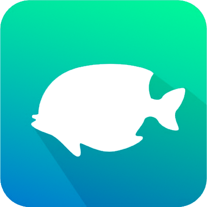
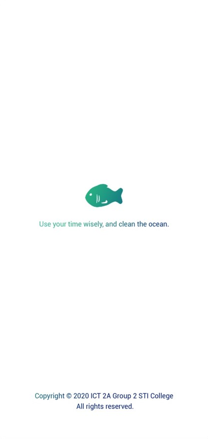
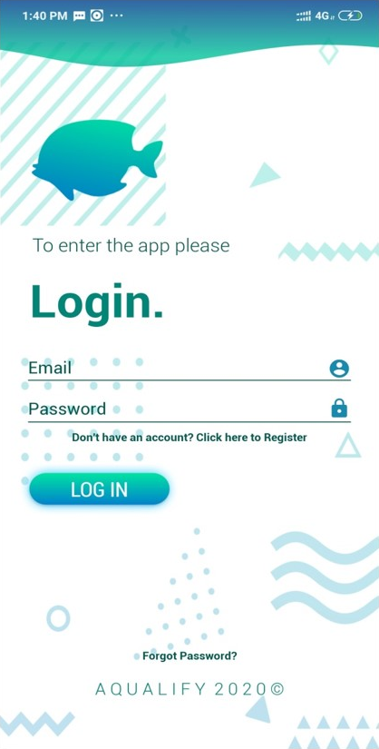
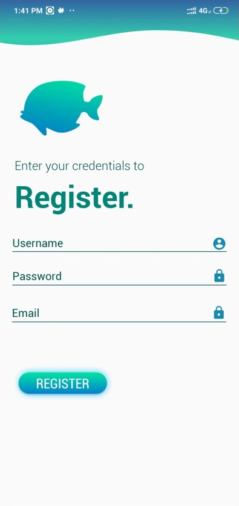
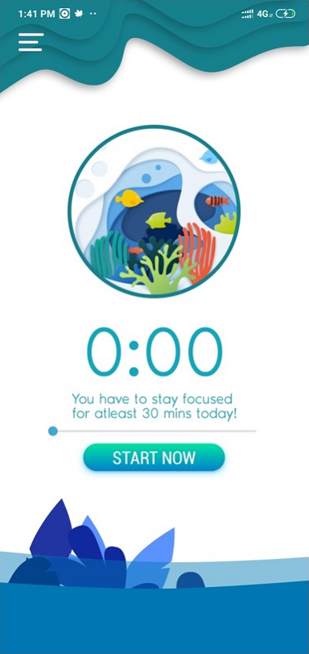
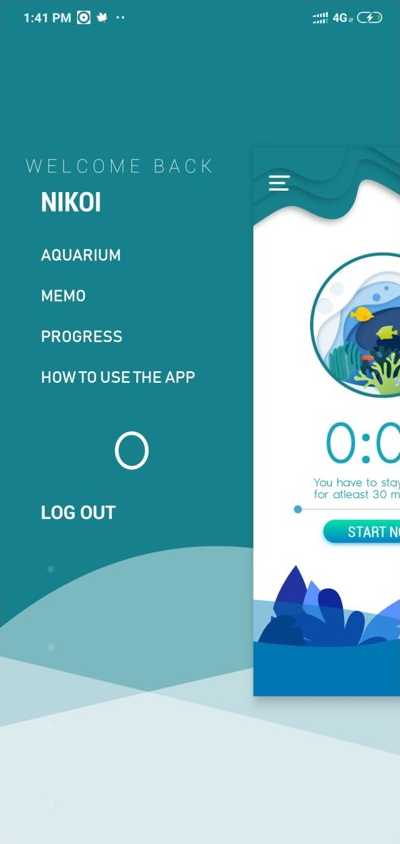
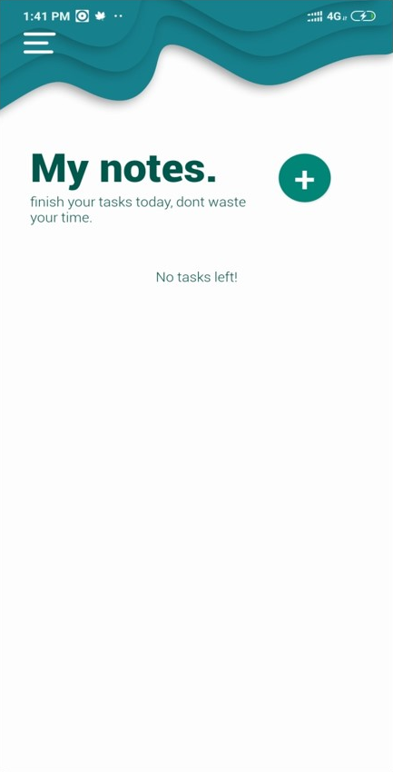
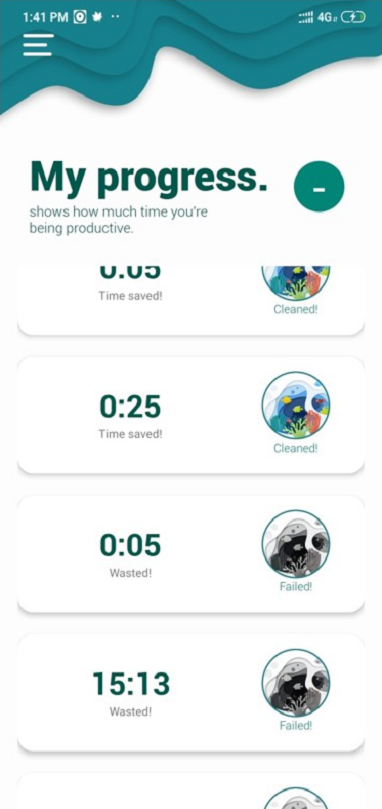
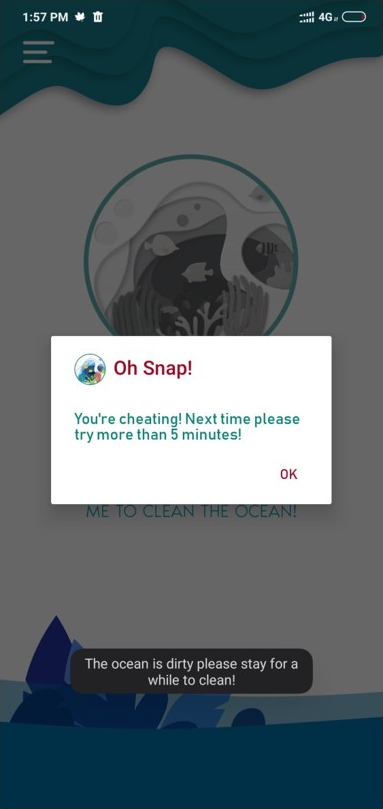

<!-- PROJECT LOGO -->
 

  

  <h3 align="center">Aqualify</h3>

  

    <h4 align="center">Anti Procrastination App</h4>
     
    <a href="https://youtu.be/f29NcSyUpY0">View Demo</a>
    ·
    <a href="https://github.com/Kim-Arcena/Aqualify-App/issues">Report Bug</a>
    ·
    <a href="https://github.com/Kim-Arcena/Aqualify-App/issues">Request Feature</a>
  

  <!-- ABOUT THE PROJECT -->
  <h2>About the Project</h2>

  
Aqualify, a multi-platform app. It is a productive and anti-procrastination app wherein it helps the users to change their gadget habits for the better and in a fun ingenious way. It’s a well-designed app that helps make the abstract idea of focusing away from your phone into a fun game It’s helpful for people who need extra help in order to sustain attention on their task and create a more balanced life. It features a Pomodoro focus timer - a personal preserve aquarium wherein the user must sustain a healthy marine environment. The condition of the marine preserve would correspond to the focus period of the user without using his/her device. The more focus the user, the healthier and cleaner the virtual marine biosphere.  .

  <h3>Overview:</h3>

  <ul>
    <li>The application uses the Pomodoro technique combined with gamification.</li>
    <li>Embedded with Patience Level wherein minutes are converted into patience points. Levels succession corresponds to a specific philosopher.</li>
    <li>The app simulates a marine aquarium wherein the health of it is based on the time spent by the users away from their phone.</li>
    <li>CRUD application with Firebase Realtime Database (db also used in Aqualify Web App)</li>
    <li>Uses Java design patterns and best practices</li>
    <li>The app simulates a marine aquarium wherein the health of it is based on the time spent by the users away from their phone.</li>
  </ul>

  <!-- BEST PRACTICES -->
  <h2>Best Practices</h2>
    <ul>
      <li>Proper naming conventions</li>
      <li>Averting from unnecessary objects creation</li>
      <li>Avoid redundant code blocks(initialization)</li>
      <li>Ordering Class Members by Scopes</li>
      <li>Organize codes by grouping packages according to usage</li>
      <li>Using the recommended android architecture</li>
      <li>Proper usage of Activity LifeCycle</li>
      <li>Utilized proven libraries </li>
    </ul>

  <!-- PROJECT SETUP -->
  <h2>Project Setup</h2>
    <ol>
        <li>Download the Zip from the website or clone from Github Desktop. (Turn off VCS integration - Optional)</li>
        <li>Copy the extracted folder into your AndroidStudioProjects folder, which must include the hidden.git folder. (Optional)</li>
        <li>Open Android Studio.<b> Go to File -> New -> Import Project.</b> Then choose the specific project you want to import and then click <b> Next->Finish.</b></li>
        <li>It will build the Gradle automatically and it will be ready to use.</li>
    </ol>
    <h3>Possible errors that you may encounter and how to solve it.</h3>
    
<b>Error:package android.support.v4.app does not exist. </b> To fix it go to <b>Gradle Scripts -> build.gradle(Module:app)</b> and the add the dependecies:
  
    <pre>
      dependencies {      
          compile fileTree(dir: 'libs', include: ['*.jar'])  
          compile 'com.android.support:appcompat-v7:21.0.3'  
      }
     </pre>
     
<b>Error:SDK location not found. Define location with sdk.dir in the local.properties file or with an ANDROID_HOME environment variable.</b>
        <b>Delete</b> the following files and go to <b>File -> Invalidate Cache / Restart.</b>

     
      .idea/gradle.xml
      .idea/workspace.xml
     
 

  <!-- APP SCREENSHOT -->
  <h2>Gallery</h2>
  <h3>App Screenshots</h3>
  
  
  
  
   
  
  
  
  
  

  <!-- EXECUTABLE APK FILE -->
  <h2>Executable APK File</h2>
  <a href="https://drive.google.com/file/d/1aS5rgG3Q1YPQh17X_qqPdo0vHTX_taXd/view?usp=sharing"><strong>Check APK Here</strong></a> 
  

  <!-- DEVELOPERS -->
  <h2>Developers</h2>
  <ul>
      <li>Senior Developer (Full Stack Android) - <a href="https://github.com/Nikkolas-Cage">Nico Guarnes</a> </li>
      <li>Junior Developer (Back End Android) - Kimberly Arceña </li>
      <li>Software Tester</li>
      <ol>
        <li>Aldrin Esquierdo</li>
        <li>Mark Daniel Caingles</li>
        <li>Ervin Papa</li>
        <li>Andrea Maxine Gonzaga</li>
      </ol>
    </ul>

